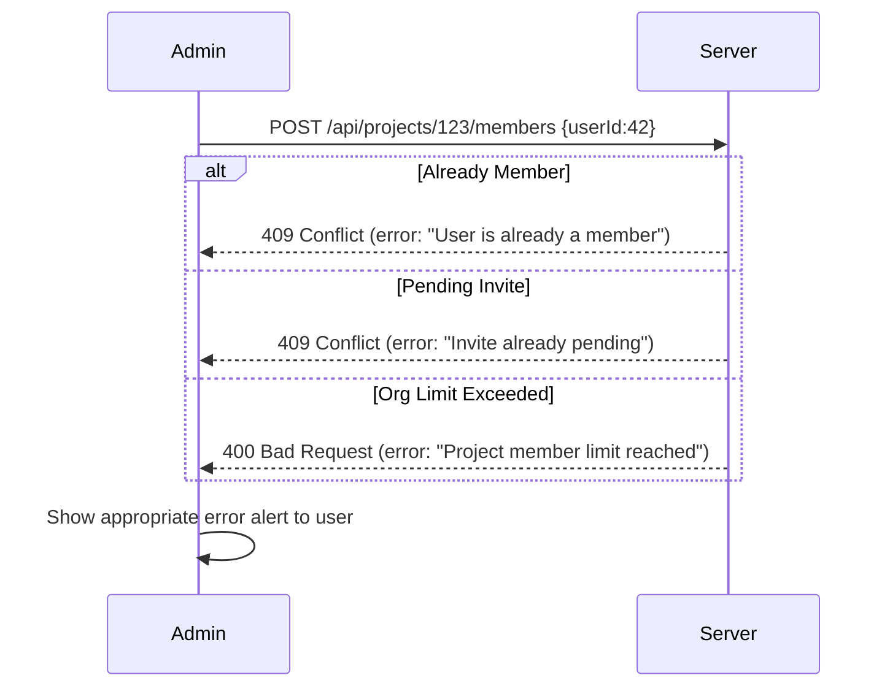

# Add Member to Project: Design & Implementation

## Executive Summary  
This report presents a **production-grade design** for the “Add Member to Project” feature. We cover the backend API endpoints (search, add, remove), data schema changes, and security requirements (pagination, rate-limits, auth checks, audit logging). We compare search options (SQL vs full-text vs Elasticsearch) with performance/cost trade-offs. We detail frontend UX: an accessible, debounced search input, keyboard navigation, loading and empty states, and consistent styling. Key interaction flows (search → select user → add or invite → accept invite) are illustrated with sequence diagrams. We enumerate data validation/business rules (unique membership, role constraints, invite expiry) and testing strategies (unit, integration, E2E, load, security). A phased deployment plan covers DB migrations, feature flags, and monitoring (API latency, error rates, search QPS, invite conversions). Finally, we provide sample API requests/responses, SQL schema snippets, React/TS pseudocode (with React Query and debouncing), and comparative tables of search and UX options. 

This comprehensive plan references industry best practices and authoritative sources for pagination, search, security, and UI design to ensure the solution is robust, scalable, and maintainable.

## 1. Backend API Design

- **Endpoints & Methods:**  
  - **GET `/api/projects/{projectId}/users/search`** – Search users to add. Query params: `q` (search text), `limit`, `cursor` (or `offset`). Returns paginated user list (id, name, email, etc).  
  - **POST `/api/projects/{projectId}/members`** – Add a member. Body: `{ userId, role }` or `{ email, role }` (for invite by email). Creates membership or pending invite.  
  - **DELETE `/api/projects/{projectId}/members/{memberId}`** – Remove a member or cancel invite.  
  - **(Optional)** PUT to update member role.  

- **Request/Response Schema:**  
  - **Search:** `GET /.../users/search?q=alice&limit=10&cursor=XYZ`. Response: `{ users: [{id, name, email}], nextCursor, totalCount }`. Include metadata (total, pages) for client use【2†L225-L232】.  
  - **Add Member:** `POST /.../members` body `{ "userId": "...", "role": "writer" }`. Response: `201 Created` with `{ memberId, projectId, userId, role }` or `409 Conflict` if already a member.  
  - **Remove Member:** `DELETE` returns `204 No Content` or `404` if not found.  

- **Pagination & Sorting:**  
  - Use cursor-based pagination for scalability【27†L276-L281】. (Alternatively offset pagination with sensible `limit` caps, e.g. max 50 per page【2†L225-L232】.)  
  - Always sort consistently (e.g. by `name ASC, id ASC`) to avoid missing/duplicate records between pages【2†L225-L232】【27†L276-L281】.  
  - Include pagination metadata (e.g. `nextCursor`, `totalCount`) or hypermedia links as in REST guidelines【2†L225-L232】【27†L276-L281】.

- **Filtering:**  
  - Support filtering by partial name/email. For example, `q=alice` matches users whose name or email contains “alice” (case-insensitive).  
  - Only return users eligible to be added (e.g. in same organization but not already members). This avoids listing current members or users the admin cannot invite.

- **Rate Limiting / Throttling:**  
  - Apply API rate limits (e.g. **X** requests/minute per user or per IP) to prevent abuse【10†L193-L200】. For search, this avoids brute-force user enumeration.  
  - Implement HTTP 429 responses on limit exceeded. On the frontend, handle 429 by showing a retry message.

- **Auth/ZTA Checks:**  
  - **Authentication:** Every request must be authenticated (e.g. JWT or session cookie).  
  - **Authorization:** Only project owners/admins can search/add/remove members. Enforce RBAC (role-based checks) or attribute-based access (ensure the authenticated user has permission on `projectId`). A 403 Forbidden is returned otherwise.  
  - **Idempotency:** Adding the same user twice should be idempotent: the second call returns 409 Conflict or success with no duplicate entry. Removing a non-member returns 404 or a no-op.  

- **CSRF & Tokens:**  
  - If the app uses cookies for auth, include CSRF protection for state-changing requests (POST/DELETE). For JSON APIs with JWT, CSRF may be less relevant but still use HTTPS.  

- **Validation:**  
  - Validate inputs strictly: ensure `userId` is a valid UUID, `role` is one of allowed enums, `email` is well-formed. Return `400 Bad Request` for invalid formats.  
  - On **search**, the query `q` should be sanitized or parameterized to prevent injection attacks. Use ORM or parameter binding (never concatenate raw SQL).  

- **Audit Logging:**  
  - Log critical actions (e.g. “User A added User B to Project X as Role Y” or “Invite sent to email@example.com”). Write to an audit table or external logging system. This supports compliance and debugging.  
  - At minimum, log: `actingUserId`, `timestamp`, `actionType` (add/remove/invite), `targetUserId/email`, and `projectId`. (See Microsoft’s team audit events for reference【23†L1-L4】.)  

- **Database Schema Changes:**  
  - Create **`project_memberships`** table (if not existing) with fields:  
    - `id SERIAL PRIMARY KEY`, `project_id` (FK), `user_id` (FK, nullable if invite), `role`, `status` (enum: `active` or `pending_invite`), `invite_token` (string), `invite_sent_at` (timestamp), `joined_at` (timestamp), etc.  
    - Unique constraint on `(project_id, user_id)` to prevent duplicate membership.  
    - Index on `(project_id, status)` for fast lookup of pending invites.  
    - Index on `invite_token` (if using token lookup).  
    - If invites use a separate table, design similarly with `invite_id, project_id, email, token, expires_at`.  
  - Existing **`users`** table likely has `id, name, email` indexed on email (unique) for quick lookup.  

Citing best practice: Always enforce an index on sort/filter columns (e.g. `name`, `email`) and a cap on `limit` to prevent heavy queries【2†L225-L232】【27†L276-L281】.  

## 2. Search Implementation Options

Choose a search strategy balancing simplicity, performance, and cost. We compare common approaches:

| **Method**            | **Pros**                                                          | **Cons**                                                            | **Typical Use-Case**                                |
|-----------------------|--------------------------------------------------------------------|----------------------------------------------------------------------|-----------------------------------------------------|
| **SQL LIKE / ILIKE**  | Very simple, uses existing SQL; low cost                              | Slow on large tables without full-text index; may need wildcard use (`ILIKE '%foo%'`) which can’t use btree index fully【5†L80-L89】.   | Small user base; simple substring or prefix search.  |
| **Trigram Index**     | Built-in Postgres GIN on `email`/`name` (with pg_trgm) allows efficient prefix/substring search. Good for partial matches. | Adds index size; may not rank by relevance (just existence).        | Autocomplete/partial search on names/emails.        |
| **Postgres FTS (GIN)**| Supports full-text queries, handles stemming/stopwords; single store. Avoids extra infra.           | Performance degrades at scale【5†L130-L139】; limited ranking; no fuzzy/typo tolerance out of box. More setup needed for multi-field search. | Moderate dataset; advanced search within longer text fields. |
| **External Search (Elasticsearch/OpenSearch)** | Extremely fast for large datasets; built-in features: fuzzy matching, relevancy scoring (BM25), autocomplete, multi-field search【5†L161-L169】. | Complex to maintain; separate infra to sync; eventually-consistent; high memory/CPU cost【5†L179-L187】. | Very large user bases or need advanced relevance ranking/search features. |
| **Third-Party (Algolia, Typesense)** | Managed service offers speed, typo-tolerance, analytics; easy frontend integration. | Recurring cost; data sync complexity; privacy considerations (data in external service). | SaaS with budget for search service. |

PostgreSQL’s full-text search works for simple text, but at high scale it “becomes a multi-second operation on millions of rows”【5†L130-L139】. ElasticSearch excels on scale and features (fuzzy matching, ranking)【5†L161-L169】 but at the cost of extra infrastructure and complexity【5†L179-L187】. For many user lists (names/emails) a simpler approach suffices: e.g. a trigram index on `name`/`email` to speed up partial matches. Table below summarizes trade-offs:

| **Option**              | **Performance**           | **Relevance Features**       | **Cost/Complexity**                              |
|-------------------------|---------------------------|------------------------------|--------------------------------------------------|
| BTree (=`name ILIKE 'foo%'`)   | Very fast for prefix with index | Exact prefix only (no typo)  | Low (no extra indexes beyond standard)           |
| Trigram + ILIKE        | Good for substring search  | Still exact matches (no stemming) | Medium (GIN index overhead)                    |
| Postgres FTS (GIN)     | Good for moderate text    | Stemming, ranking with `ts_rank` | Low (built-in)                                  |
| Elasticsearch Cluster  | Excellent at scale (ms)   | Fuzzy, BM25 ranking, multi-field | High (infra, dev ops)                           |
| Algolia/Managed Search | Excellent, easy to tune   | Out-of-box relevance, typo   | High (subscription fees)                         |

**Recommendation:** For most project member search, a SQL-based solution is sufficient. Use indexed columns on `name` and `email` (possibly with trigram indexes for partial matching). Apply `WHERE name ILIKE $1 OR email ILIKE $1` in the query. Monitor performance; if user count grows very large or advanced search needed, consider moving to a dedicated search engine. Always enforce a sensible `LIMIT` and implement pagination【2†L225-L232】【27†L276-L281】.

## 3. Security & Privacy

- **Who Can Search/Add:** Only users with the proper project-level permissions (e.g. Owner/Admin) can query the search API and add members. Enforce this on every request. Also ensure that the search results only include users that the requester is allowed to see (e.g. within the same organization).  

- **Rate Limiting & Abuse:** As noted, apply rate limits on the search endpoint to prevent automated enumeration or DDoS【10†L193-L200】. For example, 60-100 searches/minute per user is common. Exceeding the limit should return 429 Too Many Requests. You may differentiate limits by user role or IP.  

- **PII Minimization:** Search results often include personal data (names, emails). Limit the response to the minimum fields needed (e.g. `id, name, email` without address, phone, etc.). Avoid returning sensitive fields unless absolutely required. For example, do not include profile photos or private attributes in this API.  

- **Data Exposure Controls:** Transmit all data over HTTPS to encrypt PII in transit. Do not log raw query strings (search inputs) in plaintext logs because “search queries become PII when associated with a specific user”【15†L139-L147】. If logging is required (for debugging), mask or hash query terms, or only log a request ID and monitor sums/metrics instead.  

- **Throttling & Result Fuzzing:** To further protect privacy, avoid disclosing whether a particular email or username exists. For instance, if a search yields no results, simply say “no matches” rather than “User not found”. You can also introduce a small random delay or uniform response behavior to mitigate timing attacks.  

- **CSRF/XSRF:** For state-changing operations (add/remove), use standard CSRF protection (e.g. SameSite cookies and CSRF tokens in headers) if sessions are cookie-based. If using JWT bearer tokens, ensure tokens cannot be stolen (send only over HTTPS, with short TTL, rotate refresh tokens).  

- **Input Sanitization:** Treat all inputs as untrusted. Use parameterized queries or ORM to prevent injection. For email and username searches, restrict the accepted character set (e.g. alphanumeric, common symbols).  

- **Audit & Logging Policy:** Log only the fact that an action occurred, not sensitive details. For example, log “Admin user X added user Y to project Z” with IDs, not emails. Keep audit logs encrypted at rest and accessible only to authorized personnel. As a best practice, log what **action** happened, **when**, and **who** performed it【10†L198-L202】.

## 4. Frontend UX

- **Search Input & Debounce:** Use a controlled `<input>` (type="search") tied to state. Apply a **debounce** of ~300–500ms to the input’s `onChange` before calling the API【8†L67-L75】. This balances responsiveness with reducing API calls. For example, wait 300ms after the user stops typing, then fire the search. Shorter debounce (200ms) feels more immediate but sends more requests; longer (500ms) reduces load. Choose per your app’s performance.  
  - *UX Table:* For context, 0ms (no debounce) triggers a request per keystroke; 300–500ms prevents unnecessary calls when the user is mid-typing【8†L67-L75】. (See Table on debounce below.)  
- **Min Characters:** Only start searching when the input has >=2 or 3 characters. This avoids heavy queries on very common short terms. Display a helper (e.g. “Enter 3+ characters to search”).  
- **Loading State:** Show a spinner or progress indicator in the search box or results area while awaiting results. Disable further typing until debounce window resets.  
- **Results List:** Display matching users in a dropdown or list below the input. Each item shows at least `Name (email)`. Highlight the matching substring (e.g. bold the query portion). If many results, implement scrolling or pagination: e.g. “Load more” button or infinite scroll within the list.  
- **Keyboard Navigation:** Allow users to navigate results using arrow keys and select with Enter. Use proper `<ul>/<li>` markup or ARIA roles (`role="listbox"`, `role="option"`) so that screen readers can announce options. On selection, either auto-fill the input or trigger add action. See ARIA authoring guidelines【18†L245-L254】 (e.g. `aria-autocomplete="list"`, manage `aria-activedescendant`).  
- **Accessibility:** Follow WAI-ARIA best practices: mark the input with `role="combobox"`, and link it to the result list via `aria-controls`, `aria-expanded` when the list is visible【18†L245-L254】. Ensure focus remains in the input while navigating the list. Announce results count using ARIA live regions if needed. All UI elements (buttons, inputs) should be reachable by keyboard and have accessible labels.  
- **Error & Empty States:**  
  - If no results found, show “No users found.”  
  - If API error (network or 429), show a descriptive message (e.g. “Network error, please retry” or “Too many requests; please slow down”). Offer a retry button.  
- **Optimistic UI:** Optionally, for adding a user: once the admin clicks “Add”, you can immediately show the new member in the UI (optimistic), then confirm when the API responds. If the API fails, roll back the UI and show an error. This makes the app feel snappier.  
- **Styling Consistency:** Use existing design system components (Input, List, Button, Alert) to match colors, spacing, and theming. The “Add Member” page should visually fit the settings section it belongs to. Center the search box if it’s a standalone page, or align it with other forms on the page.  

## 5. Interaction Flows (Diagrams)

Below are key flows illustrated via Mermaid sequence diagrams. These flowcharts map the interactions between user, frontend, and backend for critical operations.

```mermaid
sequenceDiagram
    participant Admin as Admin UI
    participant Server
    Admin->>Admin: Enter search query (debounced)
    Admin->>Server: GET /api/users/search?q=John&limit=10
    Server->>Server: Validate auth, query DB (name/email LIKE 'John%')
    Server-->>Admin: [{id:42, name:"John Doe", email:"john@example.com"}, …] + pagination
    Admin->>Admin: Display search results list
    Admin->>Admin: Click “Add” on one user
    Admin->>Server: POST /api/projects/123/members {userId:42, role:member}
    Server->>Server: Check if already member; insert row into memberships
    Server-->>Admin: {success:true, memberId:567}
    Admin->>Admin: Show success toast / update member list
```

```mermaid
sequenceDiagram
    participant Admin
    participant Server
    participant Invitee as User Email/Inbox

    Admin->>Server: POST /api/projects/123/members {email:"new@user.com", role:member}
    Server->>Server: Check if user exists; it doesn't -> create invite token
    Server->>Invitee: Send invitation email with token link
    Server-->>Admin: {success:true, inviteId:890}
    Admin->>Admin: Show “Invitation sent” message

    Invitee->>Invitee: Receives email, clicks link
    Invitee->>Admin: (Browser) GET /app/invite?token=abcdef
    Admin->>Server: POST /api/auth/accept-invite {token:"abcdef"}
    Server->>Server: Verify token, mark accepted, create membership (user_id present after signup)
    Server-->>Admin: {success:true, projectId:123}
    Admin->>Invitee: Display “Invite accepted!” and redirect to project page
```



## 6. Data Validation & Business Rules

- **Unique Membership:** Enforce `(project_id, user_id)` uniqueness in DB. If an admin tries to add a user who is already an active member, return a 409 Conflict. Similarly, if an invite is already pending for that email, do not create a duplicate (return 409 with a message).  
- **Role Assignment:** Define allowed roles (e.g. `owner`, `admin`, `member`, `reader`). Ensure the acting user cannot assign a role higher than their own. For example, only an `owner` can add another `owner`. Sanitize and validate the `role` field against allowed values.  
- **Permissions & Limits:** Check any organizational limits (e.g. maximum members). If adding a user exceeds the limit, reject with a clear error. This enforces business constraints (e.g. paid plan member caps).  
- **Invite Handling:**  
  - Generate secure random tokens for invitations, store a hashed version if security is high (so raw token is never stored) and an expiry time (e.g. 7–30 days)【21†L139-L147】. Expire invites after a reasonable period to reduce risk.  
  - If a token is expired or invalid on acceptance, return an error and allow admin to resend. Do NOT indefinitely extend invites. (Long-lived invites “grow the key space” vulnerability【21†L139-L147】.)  
  - Allow admins to **resend** an existing pending invite (re-email the same token or a new one) and **cancel** invites (delete the pending invite entry).  
- **Input Validation:** All user input must be validated and sanitized. E.g., check that an entered email is in proper format and belongs to a user record before creating an invite.  Reject any disallowed characters.  
- **Audit Trail:** Every add/remove/invite/cancel action should record who initiated it and when. This may involve writing to an `audit_logs` table in the same DB or an external logging service, ensuring traceability.  

## 7. Testing Strategy

- **Unit Tests:**  
  - Test the search logic with mock DB: given a sample user list, confirm that searching for substrings/terms returns correct results.  
  - Test the “add member” function: valid inputs create a membership; duplicate or invalid inputs raise appropriate errors.  
  - Validate invite token generation and expiry logic.  

- **Integration Tests:**  
  - Use a test database to call the real API endpoints. E.g., simulate an admin adding a user, then query the DB to ensure the user was added.  
  - Test the invite flow end-to-end: admin creates invite, API sends token, simulate token acceptance.  
  - Verify unauthorized access is blocked (e.g. a non-admin user calls add or remove and gets 403).  

- **End-to-End (E2E) Tests:**  
  - Automate the UI flow with tools like Cypress or Selenium: admin logs in → navigates to Add Member page → searches and adds a user → verifies the new member appears in the member list.  
  - Include mobile/responsive layout tests to ensure the search interface works on phones.  
  - Test error scenarios: e.g. API returns 500 or 429, ensure the UI shows an error.  

- **Load/Performance Tests:**  
  - Benchmark the search API under load: e.g., use a tool to fire concurrent search requests (simulate many users typing). Ensure the DB can handle expected QPS; monitor slow queries (add indices as needed).  
  - Test the service under heavy invites (e.g. 1000 invites in short time) to check email queue and database throughput.  

- **Security Tests:**  
  - Attempt SQL injection or overly long strings in the search input to ensure sanitization.  
  - Try adding members with insufficient privileges to confirm authorization.  
  - Penetration test for CSRF, XSS in any new UI (even though we use React, ensure user inputs are escaped).  

- **QA Checklist:**  
  - Confirm all API responses follow the documented schema and status codes.  
  - Check that pagination works (nextCursor moves forward, no duplicates).  
  - Verify UI matches design: spacing, fonts, colors consistent.  
  - Test keyboard-only navigation for accessibility.  
  - Test performance: search latency under load, page load of members.  
  - Regression test existing settings pages to ensure this addition did not break anything.

## 8. Deployment & Migration Plan

- **DB Migrations:**  
  - Write idempotent migrations to create or alter the `project_memberships` (or invites) table and add necessary indexes. Ensure these run before deploying the backend code that relies on them.  
  - Use a migration tool (e.g. Flyway, Knex, Alembic) as per the project’s stack.  
  - If using feature flags, wrap new code paths in a flag until DB is ready.  

- **Feature Flag Rollout:**  
  - Initially deploy the backend APIs behind a feature flag or config switch so the UI can integrate gradually. This avoids breaking production traffic.  
  - Deploy frontend changes (search UI) behind the same flag. Toggle on after thorough staging tests.  

- **Backward Compatibility:**  
  - These changes shouldn’t affect existing endpoints, so normal functionality continues. Adding new routes will not break old clients.  
  - If an existing “list members” API returns members, ensure new member rows appear with correct data.  

- **Monitoring and Metrics:**  
  - Instrument the new APIs (search/add/remove) with metrics: request count, latency histogram, error count. Use logging/monitoring (e.g. Prometheus/Grafana or a cloud APM) to track performance.  
  - Track specific KPIs: **search QPS**, **average search latency**, **invite acceptance rate**, **number of active members per project**, **HTTP 4xx/5xx rates**.  
  - Set alerts: e.g. if error rate >1%, or DB query timeouts.  
  - Monitor the email invite system: how many invites sent vs. accepted, bounce rate on emails. This identifies issues in onboarding.  

- **Rollback Plan:**  
  - If critical issues arise, be able to disable the feature via flag and roll back to previous release safely. DB schema additions should be non-destructive (adding tables/columns only).  

## 9. Implementation Checklist (Prioritized)

1. **Design & Migrate DB Schema** – Define `project_memberships` table, fields, and indices (Medium).  
2. **Implement Search API** – Backend: write query, pagination, and apply auth checks (Medium). Frontend: create search component with debounced input (Medium).  
3. **Implement Add/Invite API** – Handle user exists vs invite by email logic, token generation (Large).  
4. **Implement Remove API** – Allow project admins to remove members or cancel invites (Small).  
5. **Email Invite System** – Create email template and sending logic (Medium).  
6. **Frontend Add Member UI** – Complete UI with “Add” buttons/actions (Medium).  
7. **Testing** – Write unit and integration tests for new code (Large).  
8. **Accessibility Review** – Ensure ARIA attributes and keyboard support (Small).  
9. **Feature Flag & Staging Deployment** – Deploy to staging for QA (Small).  
10. **Documentation** – Update API docs (OpenAPI, README) with new endpoints (Small).  

Code Review Checklist:  
- Verify all new endpoints validate auth and input.  
- Check error messages are clear and use correct HTTP status codes.  
- Ensure no sensitive data leaks in logs or UI.  
- Validate consistent code style and reuse of existing utility functions.  
- Confirm frontend components handle all states (loading, error, empty) gracefully.  

## 10. Examples & Code Snippets

### API Example Requests/Responses

**Search Users** (pagination):  
```
GET /api/projects/123/users/search?q=alice&limit=10&cursor=abc123
Response 200 OK:
{
  "users": [
    { "id": "42", "name": "Alice Smith", "email": "alice@example.com" },
    { "id": "57", "name": "Alicia Jones", "email": "alicia@domain.com" }
  ],
  "nextCursor": "mno456",
  "totalCount": 58
}
```

**Add Member (existing user):**  
```
POST /api/projects/123/members
Content-Type: application/json
{ "userId": "42", "role": "writer" }

Response 201 Created:
{ "memberId": "890", "projectId": "123", "userId": "42", "role": "writer" }
```

**Add Member (invite by email):**  
```
POST /api/projects/123/members
{ "email": "newuser@example.com", "role": "member" }

Response 201 Created:
{ "inviteId": "abcxyz", "projectId": "123", "email": "newuser@example.com" }
```

**Remove Member:**  
```
DELETE /api/projects/123/members/890
Response 204 No Content
```

**Error (already a member):**  
```
POST /api/projects/123/members { "userId": "42" }
Response 409 Conflict:
{ "error": "User 42 is already a member of project 123." }
```

### Sample SQL Schema Changes (PostgreSQL)

```sql
-- New table for project memberships/invites
CREATE TABLE project_memberships (
  id SERIAL PRIMARY KEY,
  project_id UUID NOT NULL REFERENCES projects(id),
  user_id UUID REFERENCES users(id),
  role VARCHAR(20) NOT NULL,
  status VARCHAR(20) NOT NULL DEFAULT 'active', -- 'active' or 'pending'
  invite_token VARCHAR(128),
  invite_expires_at TIMESTAMP,
  invited_at TIMESTAMP,
  joined_at TIMESTAMP,
  UNIQUE(project_id, user_id)
);

-- Index for fast lookups on invites
CREATE INDEX idx_pm_project_status ON project_memberships(project_id, status);
CREATE INDEX idx_pm_invite_token ON project_memberships(invite_token);
```

### React/TypeScript Pseudocode for Search Component

```tsx
// Pseudocode using React Query and a debounce hook
function MemberSearch() {
  const [query, setQuery] = useState("");
  const debouncedQuery = useDebounce(query, 300); // 300ms debounce
  const { data, isLoading, error } = useQuery(
    ['searchUsers', debouncedQuery],
    () => api.searchUsers({ q: debouncedQuery, limit: 20 }),
    { enabled: debouncedQuery.length >= 2 } // only search if 2+ chars
  );

  useEffect(() => {
    if (error) {
      showToast("Error searching users: " + error.message);
    }
  }, [error]);

  return (
    <div>
      <Input
        placeholder="Search users..."
        value={query}
        onChange={e => setQuery(e.target.value)}
        aria-label="Search users"
      />
      {isLoading && <Spinner />}
      {!isLoading && data && (
        <List role="listbox" aria-labelledby="search-label">
          {data.users.map(user => (
            <ListItem
              key={user.id}
              role="option"
              onClick={() => addUserToProject(user.id)}
            >
              <strong>{user.name}</strong> <em>{user.email}</em>
            </ListItem>
          ))}
          {data.users.length === 0 && <div>No users found</div>}
        </List>
      )}
    </div>
  );
}
```

### Comparison Tables

**Search Implementation Options**

| Option             | Speed       | Features                      | Complexity/Cost      |
|--------------------|-------------|-------------------------------|----------------------|
| SQL B-Tree Index   | High (prefix) | Exact matches, very fast prefix | Low (built-in)       |
| Trigram Index      | Moderate    | Partial/substring search      | Medium (index size)  |
| Postgres FTS       | Good (mid-size) | Stemming, ranking (basic)    | Low (built-in)       |
| Elasticsearch      | Excellent   | Fuzzy, BM25 relevance, analytics | High (infra)       |
| Managed Service    | Excellent   | Advanced (auto-complete, analytics) | High (subscription)|

**Rate-Limit Settings**

| Scope            | Limit (per minute) | Comments                                  |
|------------------|--------------------|-------------------------------------------|
| Per-user (auth)  | 60–100             | Protect against misuse (adjust to scale)  |
| Per-IP           | 200–300            | Additional layer for anonymous queries    |
| Burst/Sliding    | e.g. 120/minute    | Allow short bursts, enforce average rate  |

**Debounce Timings (Search Input)**

| Delay   | User Perception | API Call Frequency | Use Case                     |
|---------|-----------------|--------------------|------------------------------|
| 0 ms    | Instant updates | Very high          | Not recommended (every keystroke) |
| 300 ms  | Feels responsive | Moderate           | Default choice for search    |
| 500 ms  | Noticeable delay | Low                | Slower typing, lighter API load |
| 1000 ms | Noticeable lag  | Very low           | Possibly too slow UX         |

   - *Recommendation:* 300–500ms is a good balance【8†L67-L75】.  

By following this design, the “Add Member” feature will be robust, efficient, and secure, aligning with industry best practices for API design, search implementation, security, and user experience【2†L225-L232】【5†L161-L169】【8†L67-L75】【15†L139-L147】【18†L245-L254】【21†L139-L147】.